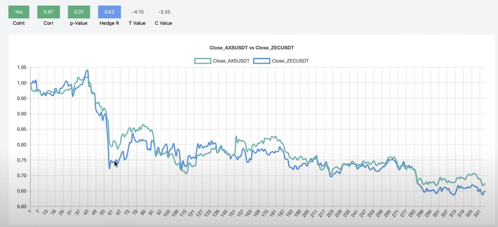

# DYDX Bot

## Convergence Trade of Two Trading pairs with Statistical Arbitrage
- In this trading mehtod, you are essentially betting that two trading pairs are going to revert to the mean. LTCM likely used the same trading method. Refer to this [link](https://phrygian-starburst-75c.notion.site/CASE-STUDY-LTCM-1a2fc52619b34e8485176176b78401d4). Below is an introduction of how it works:
  1. identify cointegrated pairs
  Cointegration is the difference between two trading pairs prices converging and diverging. Two trading pairs that are cointegrated are generally correlated. However, being correlated doesn't mean that the two prices will cross (aka mean revert). If this is the case, the two trading pairs doon't meet the requirements to be cointegrated. 
    - Below is an example of cointegrated pairs.
    
    - Below is an example of correlated but not cointegrated pairs
    
    - Cointegrated pairs with in `python` can be represented with `statsmodel`
    ```
    from statsmodels.tsa.stattools import coint
    coint_res = coint(series_1, series_2)
    ```
  2. Spread is used as a indication that there is a chance for mean reversion. The larger the spread the higher the possibility of mean reversion
  
  3. But what is the likelihood of mean reversion when the spread is wide? The answer is the Z-score spread.
  
    - From the image above, you can see that the spread sometimes has a z-score or standard deviation of 4. At 4 standard deviations, it means the current number has a chance of 0.01% outside the mean, giving it a high probability that it will revert back to the mean. Refer to [magnitudes in standard deviation](https://phrygian-starburst-75c.notion.site/Standard-Deviation-Magnitudes-710aaf85c6ed41a9898d3abee2713c65) for more information.

- Important concepts used for this code:
  - z-score: (x - mean) / std
  - Spread: series_1 - (hedge_ratio * series_2)
  - Hedge Ratio: How much of one trading pair would I need to buy relative to another trading pair. i.e. 16 ETH equals to 1 BTC
  - Half-Life: How long will it take for our spread to revert. It can be argued that this is one of the [reasons](https://phrygian-starburst-75c.notion.site/Two-views-of-risk-and-return-Capital-Ideas-Online-Kelly-Criterion-Convergence-Trade-LTCM-84556317915941108047e7d716b7b60c) that LCTM failed.
  - Kelly Criterion: position sizing for risk management. It can be argued that this is another [reason](https://phrygian-starburst-75c.notion.site/Two-views-of-risk-and-return-Capital-Ideas-Online-Kelly-Criterion-Convergence-Trade-LTCM-84556317915941108047e7d716b7b60c) that LCTM failed.

## Setup Instructions
- Have Metamask wallet, change to Goerli Network
- Go to Goerli Faucet to send ETH
- Head to DYDX exchange to connect wallet with Goerli test network, remember to click on "remember me"
- Then inspect element -> Application -> Local Storage -> "trade.stage.dydx.exchange" -> find "STARK_KEY_PAIRS" and "API_KEY_PAIRS"
- Information to collect for DYDX to add to `.env`:
  - ETHEREUM ADDRESS
  - ETH PRIVATE KEY
  - STARK PRIVATE KEY
  - DYDX API KEY
  - DYDX API SECRET
  - DYDX API PASSPHRASE
  - HOST = API_HOST_GOERLI
- check python version with `python3 --version`
- create a python virtual environment with `python3 -m venv venv`
- run `source venv/bin/activate`
- run `pip3 install -r requirements.txt`. requirements.txt is found in the course resources
- then initialize git, `git init`
- in `.gitignore` add `.env` and `venv` to ignore these files and folders

## Start
- in root, run `source venv/bin/activate` to activate venv environment
- go to `cd program`
- run `python3 main.py`
- there should be output below:
```
Connection Successful
Account ID:  <ID>
Quote Balance:  <Amount>
```
- run `deactive` to exit venv environment

## Operation
- Connect to DYDX
- Place Market Order
- Abort All Open Orders
- Construct Market Prices & Store Cointegrated Pairs: Find all market prices pairs, put them in table and find, based on the prices, which one is cointegrated.
  - Get ISO times: refer to DYDX `fromISO` and `toISO`, with `limit`
  - Get historical candles
  - Construct market prices
  - Write conintegration functions
  - Find and store cointegration pairs
- While True
  - Manage Existing Trades & Open Positions
    - Create bot agent class
      - Open Trades
      - Check Validity of Order Status by ID
    - Get recent candles
    - Check if exit and exit open trades
    - Check open positions
    - Place and save trades

## Deploying to AWS EC2
- Steps to setup AWS EC2: 
  1. Upload code and venv
  2. add environment variable
  3. add cron job
- Create security groups with preferred name with description on the permissions like `Allows SSH for developers`
  - Add rule of SSH type and allow all IP addresses. Then create security group.
- Go to EC2, launch instances, Amazon aws and ubuntu are normally free tier. Select ubuntu
- For architecture, might want to select ARM if using ARM, else, select Intel x86
- Create key pair is recommended
- Click on "Actions", click on "Connect" and "Connect"
- Go into ubuntu terminal
  - `sudo apt-get update`
  - `python --version` then install `sudo apt-get install python3.10`
- In local repo, `pip3 freeze > requirements.txt` then commit to github
- Go to github repo -> code -> get https url to add the file in ubuntu `git clone https://github.com/chickensmitten/dydx-bot.git dydx_bot`
- in ubuntu terminal enter into the `dydx_bot` folder and run `pip3 install -r requirements.txt`
- `touch .env` then `sudo nano .env`, then put it all your env variables, then ctrl + x to exit, with y then enter.
- `cd program` then run `python3 main.py`
- When code is updated in local repo, in ubuntu cli, have to run `git reset --hard HEAD` then run `git pull origin --rebase`

## Automate with CRON in AWS EC2
- refer to `crontab.guru`
- How to read cron job
```
crontab -e
CRON item - Daily
0 12 * * * /bin/timeout -s 2 86330 python3 dydx_bot/program/main.py > output.txt  2>&1
CRON item - 5 Mins
*/5 * * * * /bin/timeout -s 2 290 python3 dydx_bot/program/main.py > output.txt  2>&1
crontab -l
```
- Then below is the anatomy to the command: 
  - `*/5 * * * * /bin/timeout` tells it when to run 
  - `-s 2 290` tells it to kill it after 290 seconds 
  - when it runs, tells it to execute `python3 dydx_bot/program/main.py`
  - then print output to `> output.txt` with `2>&1` at the end. Refer to this [link](https://stackoverflow.com/questions/818255/what-does-21-mean)
  - `crontab -l` sees what cronjob is listed
- Setting up cronbjob in ubuntu
  - in ubuntu cli, start with `crontab -e` to edit. 
  - select nano editor
  - then paste one of the cron items
  - ctrl + x to save
  - type `top` to see if the cronjob is running, you should see python3 running after your determined period
- to close all positions manually, go to ubuntu cli, program directory, then run the main.py file to close all positions before shutting it down.

## Explanation on Files
- `__pycache__` is a folder for compiled python 3 bytecode
- `constants.py` contains all the constants. It also functions as on-off switch for specific functions
- `func_connections.py` contains connection to DYDX. 
- `func_private.py` contains execution functions that requires private keys
- `func_public.py` contains execution functions that are public
- `func_utils.py` contains commonly shared functions
- `func_cointegration.py` contains code to caculate and store cointegration. `calculate_zscore`, `calculate_half_life`, `calculate_cointegration` contains battle tested code, suitable for production.
- `func_bot_agent.py` builds bot agents. In `open_trades`, two orders will be opened because for the cointegration to work, you need two opposing trades to converge.
- `func_open_positions.py` will open trading positions
- `func_messaging.py` will send messages to telegram

## Miscellaneous
- `f-string` is a new string formatting mechanism known as Literal String Interpolation or more commonly as F-strings (because of the leading f character preceding the string literal). The idea behind f-strings is to make string interpolation simpler. 
```
val = 'Geeks'
print(f"{val}for{val} is a portal for {val}.")
 
name = 'Tushar'
age = 23
print(f"Hello, My name is {name} and I'm {age} years old.")
```
- use `breakpoint()` to debug
- testnet data is not as accurate as mainnet data. To do backtesting, use mainnet data without real trading.

## KIV
- Order expiration less than 1 minute
Got the following error `Error closing all positions:  DydxApiError(status_code=400, response={'errors': [{'msg': 'Order expiration cannot be less than 1 minute(s) in the future'}]})`. It is likely related to this code. `expiration = datetime.fromisoformat(server_time.data["iso"].replace("Z", "")) + timedelta(seconds=70)` It is likely a GMT error, have to added more `seconds`
